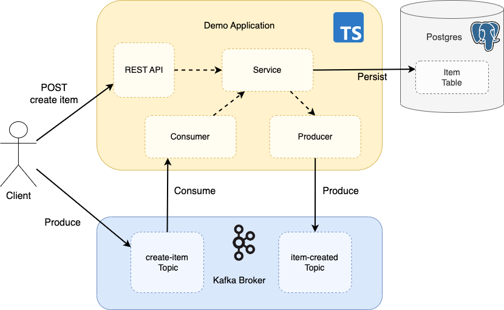

# KafkaJS Consume and Produce Demo Project

## Overview

Typescript application using the KafkaJS client library to integrate with the Kafka messaging broker to send and receive events.  It uses Prisma as the ORM tool to integrate with the Postgres database.  The project also demonstrates integration testing the application.  It uses Testcontainers to spin up Kafka and Postgres in Docker containers for the application to integrate with, enabling end to end testing.

The application provides a REST API to create and retrieve items.  When an item is created (persisted to the database), it emits an event to the `item-created` Kafka topic.  It also consumes messages from the `create-item` topic which likewise persists the new item on the database and emits corresponding events to the `item-created` topic.





## Build & Test

To build and test:

```
npm install
npx prisma generate
npm run test
```

Run unit and integration tests separately:
```
npm run test:unit
npm run test:integration
```

The integration tests use Testcontainers to spin up Kafka, Zookeeper and Postgres in Docker containers.  The application then integrates with these for the end to end tests, with the test using the application's REST API and sending and receiving events via Kafka.

To keep the Kafka and Postgres containers up between test runs, add the following variable to the `.env` file in the root of the project:
```
TESTCONTAINERS_REUSE_ENABLE=true
```
Remove or change to `false` for Testcontainers to bring down the Docker containers at the end of a test run.

## Run Application

The docker-compose file starts Kafka, Zookeeper, Postgres and the application itself.  To build the application container and start the containers:
```
docker-compose build --no-cache
docker-compose up -d
```

Alternatively, run application in Docker (if not using docker-compose):
```
docker build -t demoapp .
docker run -p 3000:3000 demoapp
```

Jump onto application container without starting the actual app (to view files etc):
```
docker run -it demoapp /bin/sh
```

Jump onto postgres container (to inspect schema etc):
```
docker exec -it postgres bash
psql -U user -d db
```

## Application REST API

The database is seeded with a version.  Get the version via the REST API:
```
curl localhost:3000/version
```

Items can be created and retrieved. To create an item:
```
curl -i -X POST localhost:3000/items -H "Content-Type: application/json" -d '{"name": "test-item"}'
```

The response location header contains the new Id.  Retrieve the item with:
```
curl localhost:3000/version/items/{itemId}
```

Note an event is also written to the `item-created` when an item is created Kafka topic - more below.

## Kafka Messaging

Verify consumer has started and is listening by listing consumer groups:
```
docker exec -ti kafka kafka-consumer-groups --bootstrap-server=localhost:9092 --list
```
Example output:
```
demo-group
```

Describe the group, showing the application consumer in the group listening to the `create-item` topic:
```
docker exec -ti kafka kafka-consumer-groups --bootstrap-server=localhost:9092 -describe --group demo-group
```
Example output:
```
GROUP           TOPIC           PARTITION  CURRENT-OFFSET  LOG-END-OFFSET  LAG             CONSUMER-ID                                  HOST            CLIENT-ID
demo-group      create-item     0          -               0               -               kafkajs-e3325d0b-f360-4f90-bbd7-55302e43a899 /192.168.112.5  kafkajs
```

An event is written to the `item-created` topic when an item is created (either via calling the REST API or sending an event to `create-item`).

Send an event to the `create-item` topic:
```
docker exec -ti kafka kafka-console-producer \
--topic create-item \
--broker-list localhost:9092
```
Now enter the message:
```
{"name": "test-item"}

Consume the `item-created` event from the command line:
```
docker exec -ti kafka kafka-console-consumer \
--topic item-created \
--bootstrap-server localhost:9092 \
--from-beginning
```
Output:
```
{"id":1,"name":"test-item"}
```

### Test Debug

Add the following to `.vscode/settings.json` under the project root to enable run/debug using the Jest Runner extension in VSCode:
```
{
    "jestrunner.jestCommand": "npm run test:integration --",
    "jestrunner.debugOptions": { "args": ["--config", "jest.config.integration.ts"] }
}
```

Change `integation` to `unit` for unit test debugging.

### Test Errors:

The app runs on port 3000.  If the app does not cleanly stop at the end of a test run you may get an error on the next test run:

```
listen EADDRINUSE: address already in use :::3000
```

Find the port and kill the process:
```
lsof -i -P | grep 3000
kill -9 <processId>
```

### Docker Clean Up

If Docker containers do not clear down they can be manually cleaned up with the following command:
```
docker rm -f $(docker ps -aq)
```

If Docker issues occur it can be useful to clean down the Docker env:
```
docker system prune
docker volume prune
```